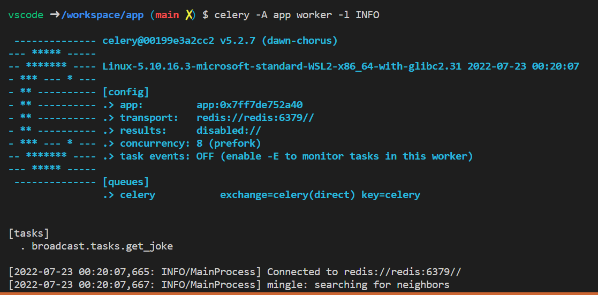

# django-channel-broadcast

Vamos implementar um broadcast de Piadas do Chuck Norris com .devcontainer e filas no celery
vamos utilizar uma API publica para buscar as mensagens e vamos utilizar celery mas o channel para 
mandar as mensagens para todos os breowsers conectados, Essa implementação vai utilizar devcontainer
com toda a integração necessária para rodar em uma maquina com docker instalado Windows, Linux ou Mac.

- [x] pré requisitos
    - [x] docker - Docker version 20.10.8, build 3967b7d
    - [x] docker-compose - Docker Compose version v2.2.2
    - [x] visual studio
    - [x] extensions: Remote - Containers
    - [x] [documentação](https://code.visualstudio.com/docs/remote/containers)

## Roteiro de desenvolvimento todos os passos já realizados

- [x] instalando django 
- [x] configurando dev container para instalação de dependencias e migrate  
- [x] configurando dependencias do projeto settings / templates
- [x] definindo no va chave de segurança settings
- [x] crianto pastas e arquivos de templates
- [x] rota padrao para acesso na url base
- [x] arquivo html usando bootstrap 5 'http://https://getbootstrap.com/'
- [x] configurando acesso a API jokes 'http://api.icndb.com/jokes/ramdom'
- [x] instalando e configurando redis
    - [x] dependencias do celery com redis ``` pip install 'celery[redis]' ```
- [x] instalando e configurando celery 
    - [x] broker
    - [x] task
    - [x] start processo beats with: ```bash celery -A app beats -l INFO```
    - [x] start processo worker with: ```bash celery -A app worker -l INFO```

 

- [x] instalando o channels
- [x] instalando o chennels_redis
- [x] configurando as filas dentro do django 
- [x] criando websocket para broadcast
- [x] atualizado dados na tela 
- [x] configurando websocket da aplicacao


### Ajudas e informações relevantes sobre  ...

**Busca de API do Chuck Norris**
Esta api retorna varias piadas para ter o efeito de broadcast foi necessário pegar  
pisda por piada dentro do resultado do endpoint 'http://api.icndb.com/jokes/ramdom'  
```python
    """ Tarefa de recuperar a piada"""
    url = 'http://api.icndb.com/jokes/ramdom'
    response = requests.get(url).json()
    index = randint(1,574)
    joke = response['value'][index]['joke']
```

**Help do Celery para start dos processos**
```bash
Usage: celery [OPTIONS] COMMAND [ARGS]...

  Celery command entrypoint.

Options:
  -A, --app APPLICATION
  -b, --broker TEXT
  --result-backend TEXT
  --loader TEXT
  --config TEXT
  --workdir PATH
  -C, --no-color
  -q, --quiet
  --version
  --help                 Show this message and exit.

Commands:
  amqp     AMQP Administration Shell.
  beat     Start the beat periodic task scheduler.
  call     Call a task by name.
  control  Workers remote control.
  events   Event-stream utilities.
  graph    The ``celery graph`` command.
  inspect  Inspect the worker at runtime.
  list     Get info from broker.
  logtool  The ``celery logtool`` command.
  migrate  Migrate tasks from one broker to another.
  multi    Start multiple worker instances.
  purge    Erase all messages from all known task queues.
  report   Shows information useful to include in bug-reports.
  result   Print the return value for a given task id.
  shell    Start shell session with convenient access to celery symbols.
  status   Show list of workers that are online.
  upgrade  Perform upgrade between versions.
  worker   Start worker instance.
```

## Referencias
 
 - https://getbootstrap.com/
 - https://docs.celeryq.dev/en/stable/
 - https://docs.djangoproject.com/en/4.0/
 - https://www.youtube.com/watch?v=AZNp1CfOjtE